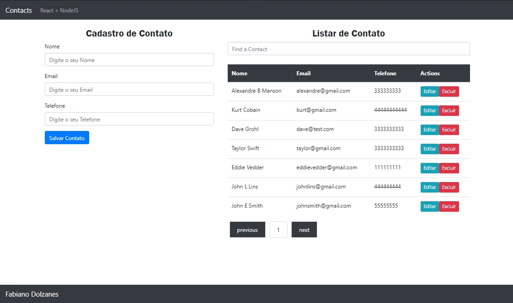

<h1 align="center">App Contact</h1>
  <p align="center">
  <strong align="center">Keep your contacts organized and up to date</strong>
</p>
  
</p>

## Built With

- [NodeJS](https://rubyonrails.org/)
- [React](https://reactjs.org/)

## How to use

```
git clone https://github.com/fdolzanes1/app-react-crud/
```

### FrontEnd

cd app-react-crud
```
npm install 
```
```
npm start
```

## Author

<table>
  <tr>
    <td align="center"><a href="https://github.com/fdolzanes1"><br /><sub><b>Fabiano Dolzanes</b></sub></a><br /><a href="https://github.com/fdolzanes1/app-react-crud" title="Code">💻</a></td>
  <tr>
</table>
